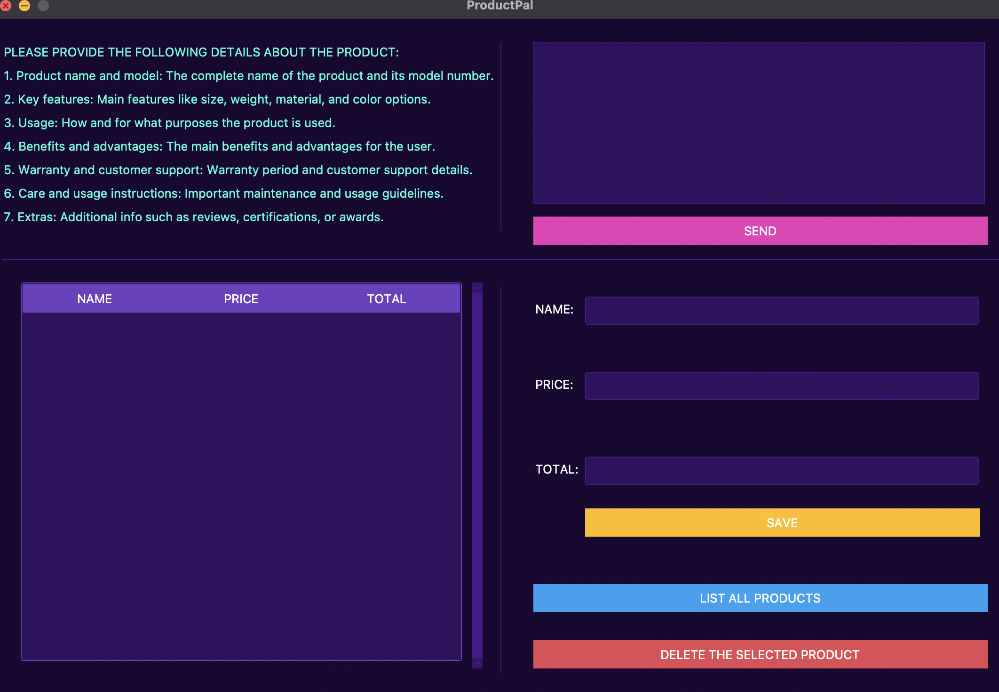

# ProductPal

**📦 A product description generator tool designed to help business owners quickly create product descriptions for their listings. This tool uses OpenAI's GPT API to generate descriptions based on the provided product details.**

---

## 🚀 Features

- **Product Description Generator:** Use OpenAI's API to automatically generate detailed, high-quality product descriptions based on a few input details.
- **Fallback Text:** If the OpenAI API is not available, the system will return pre-written fallback descriptions, ensuring the user can still proceed with their tasks.
- **Time-Saving:** Quickly generate product descriptions, saving valuable time for business owners.
- **Easy Integration:** The tool can be integrated into existing product listing systems or used as a standalone service.

---

## 🛠️ Technologies Used

- **Python**: The core language used for building the application.
- **OpenAI GPT-3 API**: Powers the automatic generation of product descriptions. (API usage requires a valid API key.)
- **SQLite**: Database used for storing product information and descriptions.
- **ttkbootstrap**: Python library used to build the application's graphical user interface (GUI).
  
---

## 📝 Disclaimer

- **Non-Commercial Use:** This product is developed purely for portfolio purposes and is not intended for commercial use. The OpenAI API was used for description generation, but due to the API’s usage limitations, the descriptions might not always be generated successfully.
- **Fallback Mechanism:** If the OpenAI API is unavailable, a fallback mechanism is in place to provide pre-written descriptions. This ensures continuity and that business owners can still use the tool effectively.
  
---

## 📊 Time-Saving for Business Owners

- **Efficiency Boost:** Business owners can save countless hours of manual work by generating product descriptions in just a few clicks.
- **Enhanced Product Listings:** By using ProductPal, the quality of product listings can be significantly improved with well-crafted descriptions.

---

## 📖 How to Set Up

To use the application:

1. Clone the repository:
   ```bash
   git clone https://github.com/taylnAydin/ProductPal.git
   cd ProductPal
2. Ensure you have the following installed:
   - **Python 3.x or later**: Required to run the application.
   - **Pip**: Python's package installer.

4. **Configure OpenAI API** (if API access is available):
   - Navigate to the `config.properties` file.
   - Replace `YOUR_API_KEY_HERE` with your OpenAI API key.

5. **Run the application**:
   ```bash
   python main.py

## 🎨 Screenshots

### Main Menu



## 💡 Future Improvements

- **Cloud Storage Integration**: Save and sync product data across devices.
- **Real-Time Feedback**: AI-generated feedback based on user input for more personalized descriptions.
- **Multilingual Support**: Add support for multiple languages to serve a broader audience.

## 🤝 Credits

- **Developed by Taylan Kemal Aydın.**
- **Special thanks to OpenAI** for providing the API that powers the product description generation feature.
